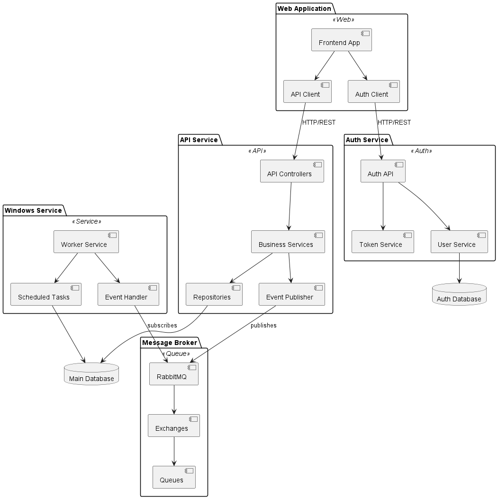
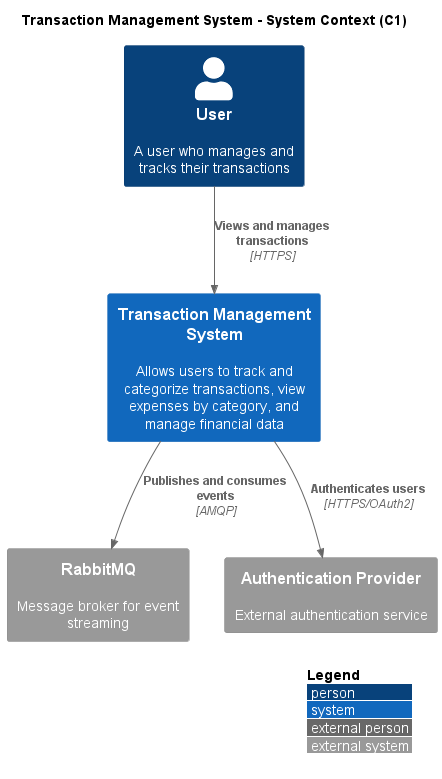
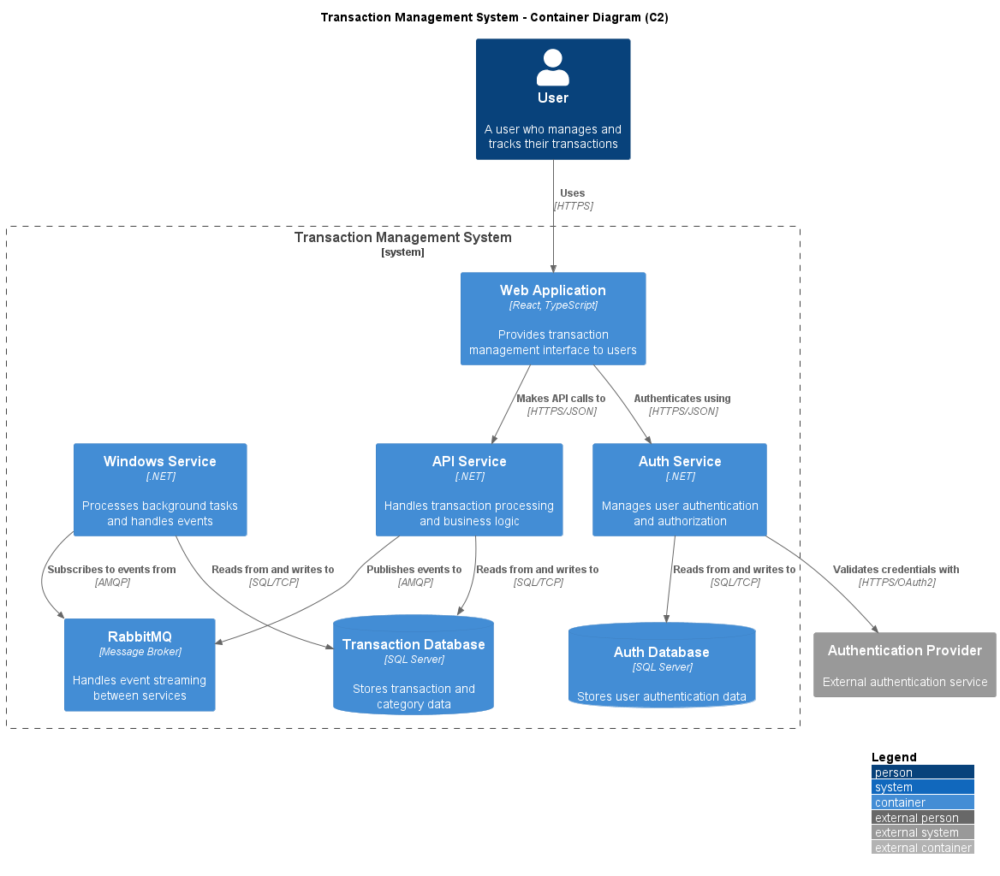
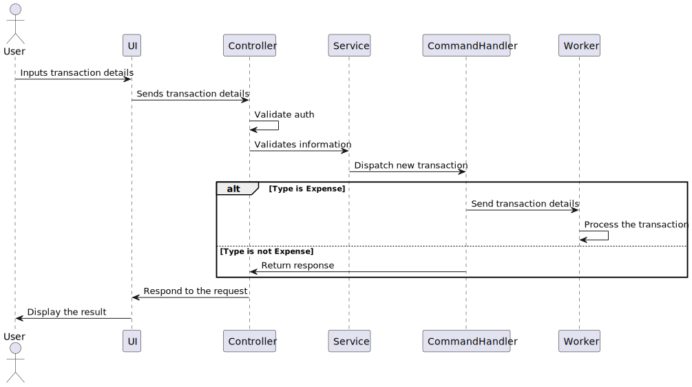

# Transaction application

## Table of Contents

1. [Introduction](#introduction)
2. [Libraries Used](#libraries)
3. [Diagrams](#diagrams)
4. [How to ?](#how-to)

## Introduction

The **Transaction Tracker** is a web application built using **React** for the front-end and **C#** for the back-end, designed to help users track their transactions. The main goal of the app is to offer an intuitive platform for managing financial transactions while providing insightful metrics.

### Key Features:

- **Track Transactions**: Users can input and view details about their transactions, including date, amount, type (expense, income, etc.), and category.
- **Dashboards**: The app provides dynamic dashboards that give users an overview of their spending, income, and overall financial health.
- **Monthly Metrics**: Monthly summaries and metrics help users analyze trends, monitor budget adherence, and spot financial patterns over time.
- **Alerts and Notifications**: The app is integrated with email notifications to alert users when certain thresholds or limits are reached (e.g., a spending limit has been surpassed).

### Technologies Used:

- **Frontend**: React.js for creating an interactive, responsive user interface.
- **Backend**: C# (ASP.NET Core) for the server-side API, managing transaction logic and user data.
- **Database**: In memory database for now to store transaction records and user preferences.
- **Email Notifications**: Integrated to send alerts when users reach specific spending limits or other defined metrics.

This app aims to empower users with the tools they need to take control of their finances through real-time tracking, insightful metrics, and proactive alerts.

---

### Architecture

## Libraries

### UI

- React.js
- React Router
- Axios
- Styled Components
- React Icons
- Zod
- Gsap

### Backend

- C# (ASP.NET Core)
- EntityFrameworkCore
- Serilog
- RabbitMQ
- FluentValidation
- AutoMapper

## Diagrams

### C1

### C2

### New transaction

## How-to

### UMl

plantuml .\newTransaction.plantuml

### Rabbit MQ

docker run -d --name rabbitmq -p 5672:5672 -p 15672:15672 rabbitmq:3-management

# FinanceTracker

### Testing:

#### Run all tests

dotnet test YourSolution.sln

#### Run specific test project

dotnet test tests/YourApi.UnitTests/YourApi.UnitTests.csproj

#### Run tests with specific tag

dotnet test --filter Category=Integration

Start flows:

#### .github/workflows/main.yml

name: Test and Build Docker

on:
push:
branches: [ main ]
pull_request:
branches: [ main ]

jobs:
test-and-build:
runs-on: ubuntu-latest

    steps:
    - uses: actions/checkout@v3

    - name: Setup .NET
      uses: actions/setup-dotnet@v3
      with:
        dotnet-version: '8.0.x'

    - name: Restore dependencies
      run: dotnet restore

    - name: Build
      run: dotnet build --no-restore --configuration Release

    - name: Run Tests
      run: dotnet test --no-build --verbosity normal
      # If tests fail, the workflow will stop here

    - name: Docker Build
      # This step only runs if tests pass
      run: docker build -t yourapi:latest .
